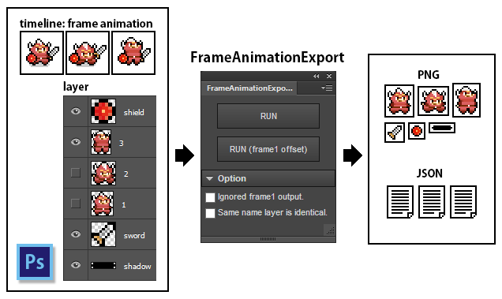
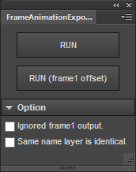
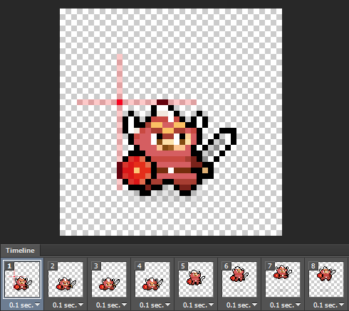
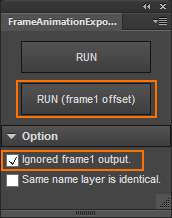
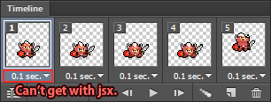

# FrameAnimationExport
=======================

Document Language [English] | [[Japanese]](README_jp.md)

FrameAnimationExport is a extension panel for Photoshop CC. 
Information on each frame of the timeline frame animation outputs a picture and json.

## Movie

[introduction movie](https://www.youtube.com/watch?v=CbO2_SfJ2CY)

---
## Download

In the case of Windows, it can save from a right-click. 

### zxp file (for Photoshop CC)

* [FrameAnimationExport.zxp](https://raw.github.com/siratama/FrameAnimationExport/master/download/FrameAnimationExport.zxp)

This file is a extension panel for Photoshop CC.
[Extension Manager Command Line tool(ExManCmd)](https://www.adobeexchange.com/resources/28) is required in order to install. 

### jsx file (for Photoshop Any Version)

* [FrameAnimationExport.zxp](https://raw.github.com/siratama/FrameAnimationExport/master/download/FrameAnimationExport.jsx)
* [FrameAnimationExportAlongFrame1Offset.zxp](https://raw.github.com/siratama/FrameAnimationExport/master/download/FrameAnimationExportAlongFrame1Offset.jsx)

There are no following functions for jsx.

* Ignored frame1 output.
* Same name layer is identical.

---
## Example of use of assets

When output data of FrameAnimationExport is read, a Photoshop frame animation can be played on the other application.

Below is the expansion panel which reads FrameAnimationExport output data in Flash Pro CC.

[FrameAnimationImport for Flash Pro CC](https://github.com/siratama/FrameAnimationImport)

---
## Feature

### RUN (frame1 offset)

Data is output with the top left of shown data of frame 1 as a origin.

When frame 1 is made identical even if it's a psd file different in the canvas size, they're able to make the coordinate equal.

### Ignored frame1 output

Indication of frame 1 arranged for coordinate offsets uses it in unnecessary cases.
A coordinate offset to frame 1 is done in case of the following setting, but frame 1 isn't output.

### Same name layer is identical

When a layer of the same name exists, those consider identical image data to be used.
When there are no checks in this checkbox,
a layer of the same name changes the name, and is output as separate image data.

When copying an identical layer, 
it can be used to confirm the indication of the surrounding frame to animation creation work by a line drawing.

---
## Problem

### Frame Animation Delay Value

It isn't possible to read the frame animation delay value of each frame in Photoshop jsx.
Therefore frame animation delay value isn't output from FrameAnimationExport.

[Photoshop.com: Ability to access "animationFrameDelay" and "animationLoopCount" via scripting](http://feedback.photoshop.com/photoshop_family/topics/issues-with-photoshop-animation-scripting-api-documentation#reply_15024879)

After reading output data of FrameAnimationExport by other application, 
it's necessary to set how long each frame is shown on the application side.

(There is a measure only a little. [FrameAnimationImport for Flash Pro CC](https://github.com/siratama/FrameAnimationImport): FAQ)

---
## output file

### file directory

	frame_animation_export/
	├ assets/
	│　└ png files
	└ json/
	  ├ info.json
	  ├ directory/
	  │　└ structure.json
	  └ layer/
		├ index.json
		└ structure.json

### JSON format

#### json/info.json

	{
		"filename":psd filename
	}

#### json/directory/structure.json

	{
		"name":folder name,
		"files":layer name array,
		"directories": nesting of this file structures
	}

reference: haxe typedef src

[src/main/lib/Directory.hx](src/main/lib/Directory.hx)

#### json/layer/index.json

	[
		layer names
	]
	
#### json/layer/structure.json

Array\<Array\<PhotoshopLayer\>\>

	[
		//frame1
		[
			//PhotoshopLayer
			{
				"name":layer name,
				"directory":folder path,
				"path":directory + name,
				"x":image bounds left,
				"y":image bounds top,
				"opacity":layer opacity
			},
			{
				...
			},
		],
		//frame2	
		[
			...
		]
	]

reference: haxe typedef src

[src/main/lib/PhotoshopLayer.hx](src/main/lib/PhotoshopLayer.hx)

