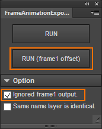

# FrameAnimationExport
=======================

Document Language [[English](README.md)] | [Japanese]

FrameAnimationExport は Photoshop CC 用拡張パネルです。
フレームアニメーション タイムラインウインドウ内 各フレームの表示情報を、画像と json に出力します。

## 紹介動画

[introduction movie](https://www.youtube.com/watch?v=CbO2_SfJ2CY)

---
## ダウンロード

Windows の場合、右クリックから「リンク先のコンテンツを保存」を選択で保存できます。

### zxp file (for Photoshop CC)

* [FrameAnimationExport.zxp](https://raw.github.com/siratama/FrameAnimationExport/master/download/FrameAnimationExport.zxp)

Photoshop CC 拡張パネル用ファイルです。
インストールには別途 [Extension Manager Command Line tool(ExManCmd)](https://www.adobeexchange.com/resources/28)が必要です。

### jsx file (for Photoshop Any Version)

* [FrameAnimationExport.zxp](https://raw.github.com/siratama/FrameAnimationExport/master/download/FrameAnimationExport.jsx)
* [FrameAnimationExportAlongFrame1Offset.zxp](https://raw.github.com/siratama/FrameAnimationExport/master/download/FrameAnimationExportAlongFrame1Offset.jsx)

jsx ファイルは以下の機能は持ちあわせていません。

* フレーム1の出力は無視
* 同名レイヤーは同一の画像とみなす

---
## 出力データ利用例

FrameAnimationExport から出力されたデータを読み込むことで、
Photoshop フレームアニメーションほぼそのままの形を 他のアプリケーション上に再現できます。

以下は、Flash Pro CC から FrameAnimationExport 出力データを読み込む拡張機能です。

[FrameAnimationImport for Flash Pro CC](https://github.com/siratama/FrameAnimationImport)

---
## 機能

### RUN (frame1 offset): フレーム1の左上座標を原点とした座標オフセット出力

フレーム1に表示される画像データの左上を原点座標(0, 0)としてデータ出力を行います。

キャンバスサイズの異なる psd ファイルでも、
フレーム1 の表示を同一にする事で座標をそろえることが可能です。

### Ignored frame1 output: フレーム1の出力は無視

座標オフセット用に配置したフレーム1の表示は不要な場合、等に利用します。
以下の設定の場合、フレーム1に対する座標オフセットは行われますがフレーム1は出力対象にはなりません。

### Same name layer is identical: 同名レイヤーは同一の画像とみなす

同名のレイヤーが存在する場合、同一の画像データを使用しているものとしてデータ出力を行います。
このチェックボックスにチェックがない場合、
同名のレイヤーは自動的に名称変更された後、別々の画像データとして出力が行われます。

線画でのアニメーション制作作業にて、
前後のフレームの表示を確認するために、同一のレイヤーを複製している場合等に利用できます。

---
## 課題

### フレームディレイ値の取得は不可

Photoshop jsx では、各フレームのディレイ値を読み取ることができないため、
各フレームがどれくらいの間隔で表示されるか、を示す情報は FrameAnimationExport からは出力されません。

[Photoshop.com: Ability to access "animationFrameDelay" and "animationLoopCount" via scripting](http://feedback.photoshop.com/photoshop_family/topics/issues-with-photoshop-animation-scripting-api-documentation#reply_15024879)

このため、FrameAnimationExport 出力データを他のアプリケーションで読み込んだ後に、
そのアプリケーション側で各フレームがどれくらい表示されるのかを設定する必要があります。

(多少の対処策はあります。
[FrameAnimationImport for Flash Pro CC](https://github.com/siratama/FrameAnimationImport) の FAQ 参考。)

---
## output file

### file directory

	frame_animation_export/
	├ assets/
	│　└ png files
	└ json/
	  ├ info.json
	  ├ directory/
	  │　└ structure.json
	  └ layer/
		├ index.json
		└ structure.json

### JSON format

#### json/info.json

	{
		"filename":psd filename
	}

#### json/directory/structure.json

	{
		"name":folder name,
		"files":layer name array,
		"directories": nesting of this file structures
	}

reference: haxe typedef src

[src/main/lib/Directory.hx](src/main/lib/Directory.hx)

#### json/layer/index.json

	[
		layer names
	]
	
#### json/layer/structure.json

Array\<Array\<PhotoshopLayer\>\>

	[
		//frame1
		[
			//PhotoshopLayer
			{
				"name":layer name,
				"directory":folder path,
				"path":directory + name,
				"x":image bounds left,
				"y":image bounds top,
				"opacity":layer opacity
			},
			{
				...
			},
		],
		//frame2	
		[
			...
		]
	]

reference: haxe typedef src

[src/main/lib/PhotoshopLayer.hx](src/main/lib/PhotoshopLayer.hx)

